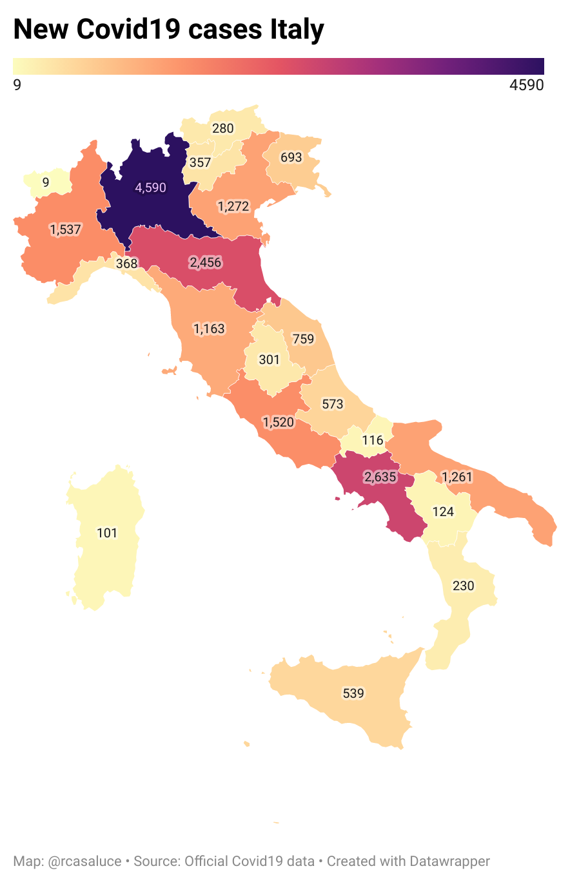

# COVID19 Italy WebApp 

This is a project that combine Google Sheets functionalities with Data wrapper tools.

[Link to the WebApp](https://datawrapper.dwcdn.net/QgwtQ/5/)

This is a dynamic map that display the new daily cases in each region, which is updated every day after 5pm (CEST).

[Link](https://docs.google.com/spreadsheets/d/e/2PACX-1vQLZIJPsTBKhzCVZ0Wgm0NJpNtDevOIP63dkwHPP9yjqXPZUqXAeTG_58Ad-b_O3z-6uaNTNxn_pGDx/pubhtml?gid=589367209&single=true) to the Google Sheets file used to query the [data](https://github.com/pcm-dpc/COVID-19/blob/master/dati-regioni/dpc-covid19-ita-regioni-latest.csv).

Map created using [Datawarpper](https://www.datawrapper.de/)

 

  

